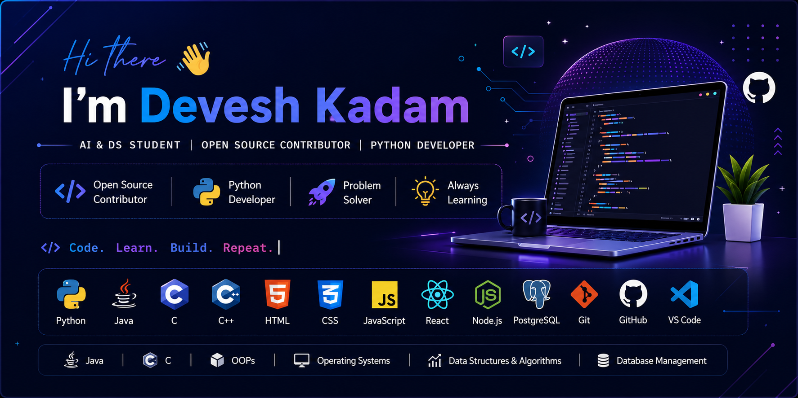

  

Welcome to my GitHub profile! I'm passionate about learning new technologies, contributing to open source, and building practical software projects.

---

## 🚀 About Me

- 🎓 AI&DS Student
- 🌱 Currently learning AI Enginnering, Web Development, and DSA
- 💻 Open Source Contributor
- 🏆 GSSoC 2026 Contributor
- 🎯 Interested in Software Development and AI-based applications

---

## 💻 Tech Stack

---

## 📂 Featured Projects

- 🐍 Snake Game (Python Turtle)
- 🏓 Pong Game (Python Turtle)
- 🌿 JeevaWell – Smart Ayurvedic Health Assistant
- 🤖 book-notes-app

---

## 📚 Currently Learning

- Data Structures & Algorithms
- Full Stack Development
- Open Source Development
- AI Enginnering
- -Machine Learning

---

## 📫 Connect With Me

: https://github.com/DeveshKadam06

---

: kadamdevesh06@gmail.com

---

: https://www.linkedin.com/in/devesh-kadam-904178315/

---

## 🐍 Contribution Snake

  

---

## ⚡ Fun Fact

⚡ Coffee fuels my coding sessions

🐍 Python is my favorite language

🎮 I enjoy building games

🌱 Always learning something new

---

"Code. Learn. Build. Repeat. 🚀"
